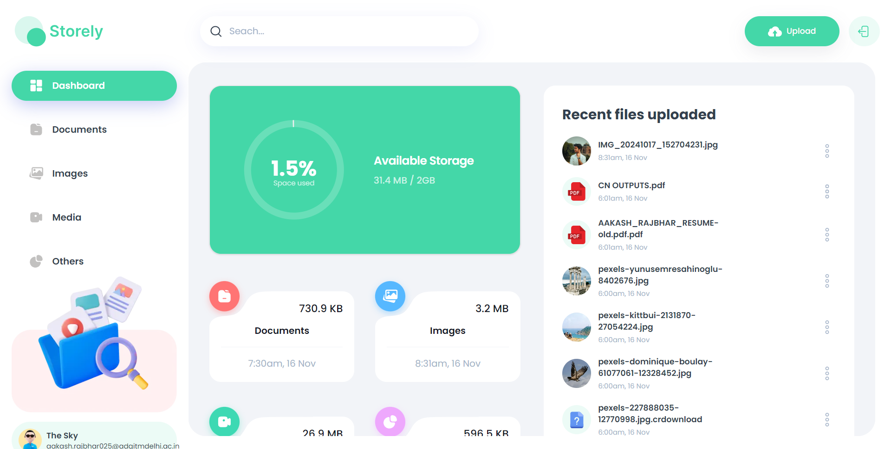

# **Storely Next.js Storage App (File Storage)**

A cloud-based storage application built with **Next.js** and **Appwrite**. This app allows users to securely upload and store various types of files such as images, videos, audio, and documents. The app also supports user authentication and the ability to share files with others.

you can see the live demo at : [storely-web.vercel.app](https://storely-web.vercel.app)



## **Features**
- **Authentication**: Users can sign up, log in, and manage their sessions.
- **File Upload**: Users can upload and store various file types (images, videos, audio, documents).
- **File Sharing**: Users can share their uploaded files with others.
- **Responsive Design**: The application is fully responsive and works on mobile devices.

## **Tech Stack**
- **Frontend**: Next.js (React.js framework)
- **Backend**: Appwrite (for authentication and file storage)
- **Styling**: Tailwind CSS
- **Deployment**: Vercel

## **Installation**

Follow the steps below to run the application locally.

### **Prerequisites**
- Node.js (>= 14.0.0)
- Appwrite account and project set up

### **Steps to Run Locally**

1. **Clone the Repository**:
   ```bash
   git clone https://github.com/aakash-rajbhar/storage-app.git
   ```

2. **Install Dependencies**:
   Navigate to the project directory and install the required dependencies.
   ```bash
   cd storage-app
   npm install
   ```

3. **Set up Appwrite**:
   - Create an Appwrite project on [Appwrite.io](https://appwrite.io).
   - Configure authentication, storage, and set up the necessary API keys.
   - Create a `.env.local` file in the root of the project and add the following environment variables:
     ```bash
     NEXT_PUBLIC_APPWRITE_ENDPOINT=<Appwrite endpoint>
     NEXT_PUBLIC_APPWRITE_PROJECT=<Your Appwrite Project ID>
     NEXT_PUBLIC_APPWRITE_DATABASE=<Your Appwrite Storage Bucket ID>
     NEXT_PUBLIC_APPWRITE_USERS_COLLECTION=<Your Appwrite Auth Secret>
     NEXT_PUBLIC_APPWRITE_FILES_COLLECTION=<Your Appwrite files collection id>
     NEXT_PUBLIC_APPWRITE_BUCKET=<Your Appwrite bucket id>
     NEXT_APPWRITE_KEY=<Your Appwrite Secret key>
     ```

4. **Run the Development Server**:
   After setting up the environment variables, run the app in development mode:
   ```bash
   npm run dev
   ```

5. **Access the App**:
   Open your browser and navigate to `http://localhost:3000` to see the app in action.

## **App Features in Detail**

### **Authentication**
- Users can sign up, log in, and manage their sessions using **Appwrite**.
- **Session management**: Appwrite handles user authentication and session management.

### **File Upload**
- Users can upload multiple file types such as images, videos, audio, and documents.
- The uploaded files are stored securely in the Appwrite storage system and are accessible to the user who uploaded them.

### **File Sharing**
- Users can share files with others via a shareable link, allowing for easy collaboration and access to stored files.

### **UI and UX**
- The user interface is designed using **Tailwind CSS**, ensuring that it is responsive and easy to use on all devices.
- The app uses modern UI components like cards, modals, and drop-downs for a smooth user experience.


